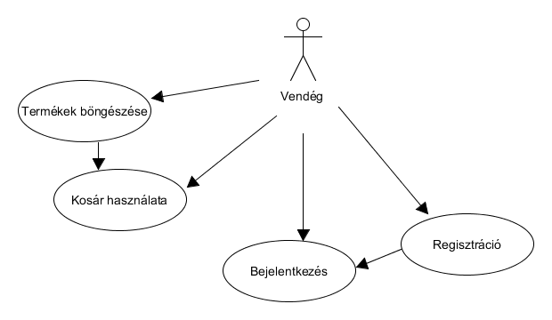
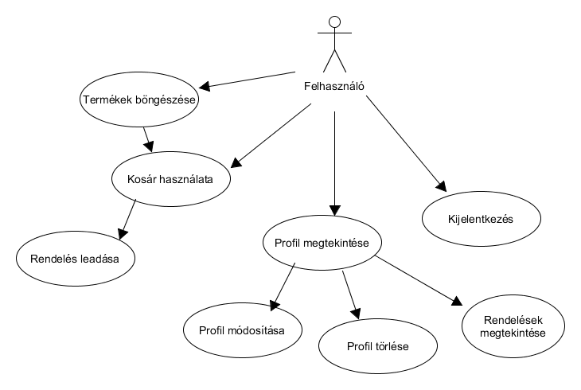
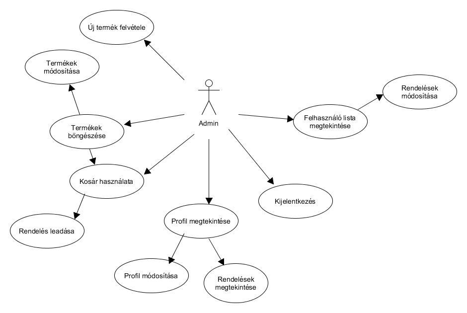
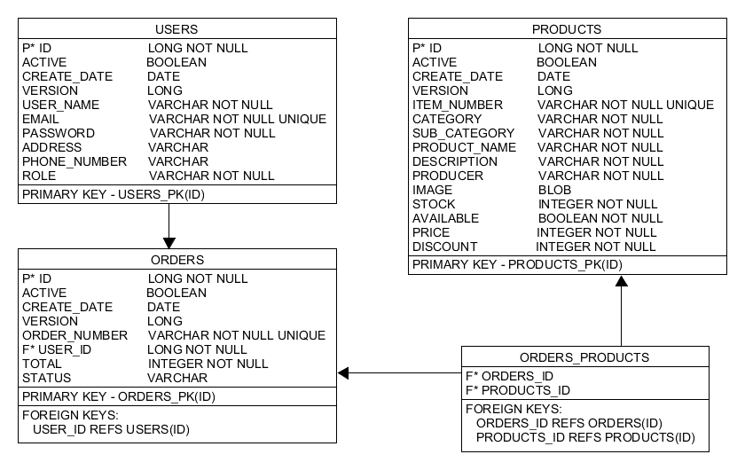
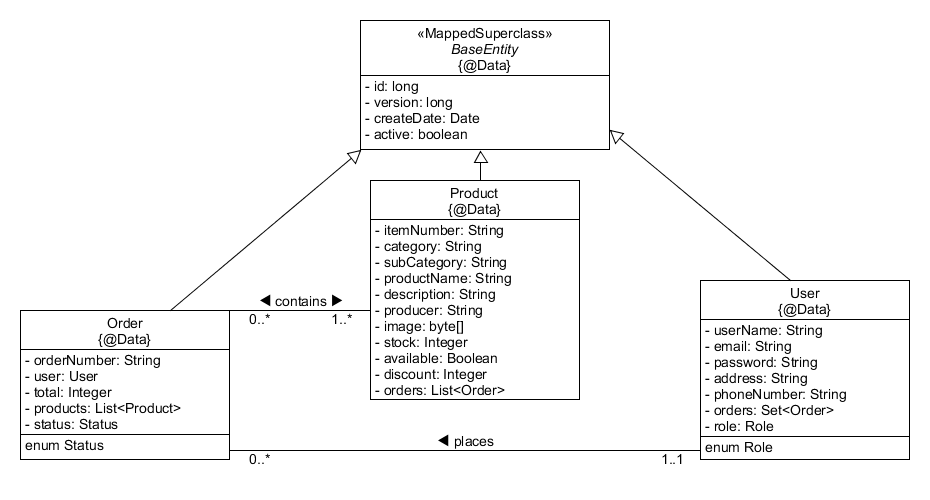

# alkfejl-bead

## Kern Krisztián (ZD3V3G) - Bors Zoltán (JNVKYO)
ELTE IK - Alkalmazások fejlesztése 2017 beadandó
## Téma: Horgászbolt Webshop

### 1. Követelmények

#### Funkcionális követelmények
 - Regisztráció
 - Bejelentkezés
 - Termékek böngészése
 - Termékek kosárba helyezése
 - Bejelentkezett felhasználóknak   
   - A kosárban lévő termékek megrendelése
   - Saját profil módosítása
   - Saját profil törlése
   - Saját rendelések megtekintése
   - Kijelentkezés
   - Adminisztrátor felhasználóknak
     - Új termék felvétele
	 - Termékek módosítása
	 - Felhasználók listájának megtekintése
	 - Egyes felhasználók rendeléseinek megtekintése
	 - Egyes felhasználók rendeléseinek módosítása
#### Nem funkcionális követelmények
  - Felhasználóbarát: Megfelelően elhatárolt funkciók. Világos látható színekkel írt betűk. Ésszerű elrendezés
  - Biztonság: Jelszóval védett funkciók. A jelszavak titkosítottak.
    A különböző űrlapoknál egy hibalistában kijelzi a program a hibákat.
  - Gyors működés: Adatbázisban operáló program, gyors kereséssekkel hamar előállítja a kívánt eredményeket.

#### Szerepek
  - Vendég
  - Felhasználó
  - Admin

### 2. Tervezés

#### Oldaltérkép
  - Publikus
    - Főoldal
	- Termékek listái kategóriák szerint
	- Kosár
	- Regisztráció
	- Bejelentkezés
  - Felhasználó
    - Saját profil
	  - Profil módosítása
	  - Profil törlése
	  - Saját rendelések megtekintése
  - Admin
    - Termékek kezelése
	  - Új termék
	  - Termék módosítás
	- Rendelések kezelése
	  - Felhasználók listája
	  - Rendelések listája
	  - Rendelések módosítása

#### Végpontok
  - Navigáció
    - '': főoldal
	- 'register': regisztrációs oldal
	- 'profile': profil oldal
	- 'products': termékek listája
	- 'cart': kosár oldal
	- 'product': termékek kezelése oldal
	- 'orders': rendelések kezelése oldal

  - API
    - /api/user: felhasználók kezelése
	  - GET/: bejelentkezett felhasználó lekérése
	  - GET/list: több felhasználó lekérése
	  - POST/login: bejelentkezés
	  - POST/logout: kijelentkezés
	  - POST/register: regisztráció
	  - DELETE/deactivate: profil törlése
	- /api/product: termékek kezelése
	  - GET/categories: kategóriák lekérése
	  - GET/list: termékek lekérése
	  - GET/search: termékek keresése
	  - GET/listDeleted: törölt termékek lekérése
	  - POST/save: termék felvétele/módosítása
	  - DELETE/delete: termék törlése
	- /api/order: rendelések kezelése
	  - GET/all: több rendelés lekérése
	  - GET/orders: a bejelentkezett felhasználó rendeléseinek lekérése
	  - POST/save: rendelés felvétele
	  - POST/update: rendelés módosítása
	  - DELETE/delete: rendelés törlése

#### Felhasználói Modell
##### Vendég

##### Felhasználó

##### Admin

#### Megvalósítás
##### Főoldal

##### Bejelentkezés

##### Regisztráció

##### Termékek böngészése

##### Kosár

##### Profil

##### Termékek kezelése

##### Rendelések kezelése

### 3. Implementáció
#### Adatbázisterv

#### Osztály modell diagram

### 4. Funkciók
  - Bejelentkezés
    1. A `Bejelentkezés` gombra kattintva megjelenik egy dialógus
	2. Meg kell adnunk az e-mail címet és a jelszót
	3. Kattintsunk a `Bejelentkezés` gombra
	4. Ha helyes adatokat adtunk meg, akkor a dialógus eltűnik és bejelentkeztünk
	5. Ha helytelen adatokat adtunk meg, akkor nem tűnik el a dialógus, hanem kiírja a hibaüzenetet
  - Regisztráció
    1. A `Regisztráció` gombra kattintva megjelenik a regisztrációs oldal
	2. Töltsük ki a megfelelő adatokkal az űrlapot
	3. Ha valamit hibásan töltenénk ki, egyből értesít erről az oldal
	4. Ha készen vagyunk, kattintsunk a `Regisztráció` gombra, a `Mégse` gomb törli az űrlapon lévő adatokat
	5. Ha sikeres volt a regisztráció, akkor erről az oldal alján értesülünk és automatikusan a főoldalra navigálunk
	6. Ha sikertelen volt a regisztráció (pl. foglalt volt az e-mail cím), akkor erről az oldal alján értesülünk és a regisztrációs oldalon maradunk
  - Kategóriák
    1. A `Kategóriák` menüpontra való kattintással megjelennek a fő kategóriák
	2. Ha az egyes főkategóriák fölé visszük az egeret, láthatjuk a hozzá tartozó alkategóriákat
	3. Ha rákattintunk egy alkategóriára, akkor kapunk egy listát a megfelelő termékekről
  - Termék lista
    1. A termékek böngészése közben lenyithatjuk a `Leírás` paneljüket több információért
	2. Ha az összes termék egy adott kategóriából nem férne ki egy oldalra (10 a limit), akkor a termékek fölötti navigációs gombokkal tudjuk elérni a többi oldalt
	3. Ha egy termék megtetszett akkor a `Kosárba!` gombbal 1 darabot belerakhatunk belőle a kosárba
	4. Ezután tovább böngészhetünk
	5. Admin felhasználóként egy extra `Szerkesztés` gomb áll a rendelkezésünkre, ami egyből az adott termékkel nyitja meg a `Termékek kezelése` oldalt
  - Kosaram
    1. A `Kosaram` menüpontnál látható az eddig kosárba tett termékek száma
	2. Rákattintva a kosár oldalra navigálunk
	3. Itt láthatjuk a kosár tartalmát, a kosárba tett termékek listáját
	4. Egy listaelemre kattintva megjelenik a termékhez tartozó részletes adatlap dialógus formájában, ahol több darabot is hozzáadhatunk a kosárhoz
	5. A listaelem melletti szemetes ikonra kattintva kivehetjük a kosárból az adott elemet
	6. A lista alján látható a rendelés végösszege, ami az egyes termékek aktuális árából számolt érték
	7. A `Rendelés elküldése` gombbal véglegesítjük a rendelést, ennek eredményéről a lap alján értesülünk
	8. Ha sikeres, akkor a főoldalra navigálunk és a kosár kiürül
	9. A `Kosár ürítése` gombbal egyszerre az összes kosárban lévő terméket kivehetjük a kosárból
  - Profil
    1. A bejelentkezett felhasználó nevével ellátott gombra kattintva eljuthatunk a profil oldalra
	2. Itt láthatjuk az összes adatunkat és módosíthatjuk is egyből őket a `Módosítás` gombbal
	3. A `Mégse` gombra kattintva kiürítjük az űrlapot
	4. A `Regisztráció törlése` gombra kattintva törölhetjük a regisztrációnkat, ám ez végleges, az e-mail cím nem lesz többet felhasználható. Emiatt egy dialógus megerősítést kér
	5. Admin felhasználó nem tudja törölni a regisztrációját
	6. A profil oldal alján megtekinthetjük a rendeléseinket időrendi sorrendben
	7. A rendeléseinkben listázott termékekre kattintva megjelenik a termékhez tartozó részletes adatlap dialógus formájában, ahol újabb darabokat is hozzáadhatunk a kosárhoz
  - Kijelentkezés
    1. A `Kijelentkezés` gombra kattintva a belépett felhasználó kijelentkezik
	2. Ezután a főoldalra navigálunk automatikusan
  - Termékek kezelése
    1. A `Termékek kezelése` menüpont csak Admin felhasználóknak áll rendelkezésére
	2. Rákattintva a Termék felvétele oldalra juthatunk
	3. Töltsük ki a megfelelő adatokkal az űrlapot
	4. Képfeltöltés is rendelkezésünkre áll
	5. Ha készen vagyunk, kattintsunk a `Termék felvétele` gombra, a `Mégse` gomb törli az űrlapon lévő adatokat
	6. Ha sikeres vagy sikertelen volt a termék felvétel, akkor erről az oldal alján értesülünk, a hibaüzenettel együtt
	7. Ha a Termék listáról a `Szerkesztés` gombbal jutottunk erre az oldalra, akkor a Termékek kezelése oldal módosító módban van
	8. Ebben az esetben ugyanúgy működik minden, mint a felvételnél, kivéve a `Mégse` gombot
	  - a `Mégse` gomb ez esetben úgy törli az űrlap adatait, hogy átvált Termék felvétel módba az oldal
	  - vagyis ezután már nem azt a terméket módosítjuk, aminek a `Szerkesztés` gombjára kattintottunk, hanem új Terméket vehetünk fel
  - Rendelések kezelése
    1. A `Rendelések kezelése` menüpont csak Admin felhasználóknak áll rendelkezésére
	2. Rákattintva a Rendelések kezelése oldalra juthatunk
	3. Először láthatjuk a felhasználók listáját
	  - Ez egy lista az összes regisztrált felhasználóról név szerinti sorrendben
	  - A felhasználónév és az e-mail cím alapján tudjuk beazonosítani a felhasználót
	  - Rákattintva egy felhasználóra megjelenik annak összes rendelése időrendi sorrendben
	4. A Rendelések oszlopban láthatjuk egy adott felhasználó rendeléseinek listáját
	  - A rendelési azonosítóját és a státuszát láthatjuk a listaelemeken
	  - Rákattintva egy rendelésre megjelenik az adott rendelés a Rendelés módosítása űrlapon
	5. A Rendelés módosítása űrlap kezdetben kitöltetlen
	  - Ha betöltöttünk egy rendelést az űrlapra, megjelennek annak főbb adatait
	  - A rendelési azonosítót és a státuszt tudjuk változtatni az űrlapon
	  - Láthatjuk emelett még a rendelt termékek listáját, a végösszeget és a rendelés idejét
	  - Csak egy kiválasztott rendelés esetén lehet rákattintani a `Rendelés módosítása` gombra

### 5. Tesztelés

### 6. Felhasználói dokumentáció

A program bármilyen operációs rendszeren futtatható.
A telepítéshez szükséges:
  - [NodeJS és npm](www.npmjs.com/get-npm)
  - Internet elérés
  - eclipse vagy NetBeans IDE javasolt a backend alkalmazás futtatásához

#### Backend telepítés:
  1. A backend QueryDsl-t használ.
  2. Ehhez fishing-shop mappában mavennel le kell generálni a Q classokat az `mvn generate-sources` parancssal.
  3. Ezután futtassuk SpringBoot applikációként a backend alkalmazást.

#### Frontend telepítés:
  1. A frontend nodejs-t használ.
  2. Ehhez a fishing-shop-frontend mappában le kell generálni a node modules az `npm i` parancssal.
  3. Ezután az `npm run ng serve` paranccsal futtathatjuk a frontend alkalmazást.